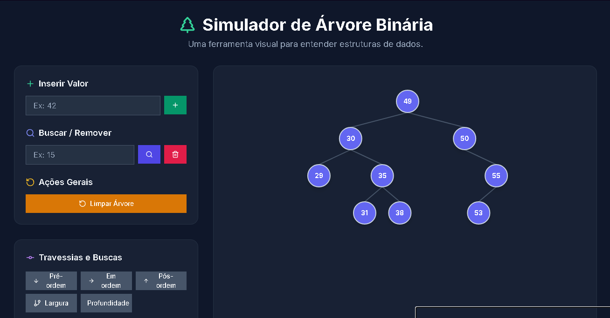

# Simulador de Árvore Binária de Busca - Trabalho Final

Este projeto é um simulador interativo de Árvore Binária de Busca (ABB) desenvolvido como trabalho final da disciplina de Estrutura de Dados.

## Aluno
- **Nome:** Felype Max Santos Silva
- **Matrícula:** 20241ADS.CNT0020

---

## Interface do Projeto

*A imagem acima mostra a interface principal da aplicação, com uma árvore de exemplo e os controles de interação.*

---

## Tecnologias Utilizadas

### Tecnologia Principal
O projeto foi desenvolvido inteiramente utilizando **JavaScript**, que compõe toda a lógica da estrutura de dados e a manipulação da interface.

### Ferramentas e Bibliotecas Secundárias
Para a construção da interface, foram utilizadas as seguintes tecnologias de apoio:

- **React.js:** Biblioteca para a construção da interface de usuário de forma componentizada.
- **Vite:** Ferramenta de build moderna para um desenvolvimento rápido.
- **Tailwind CSS:** Framework de estilização para a criação do design visual.
- **Framer Motion:** Biblioteca para a implementação das animações.

## Como Executar o Projeto
1. Clone o repositório.
2. Instale as dependências com `npm install`.
3. Rode o projeto em modo de desenvolvimento com `npm run dev`.
